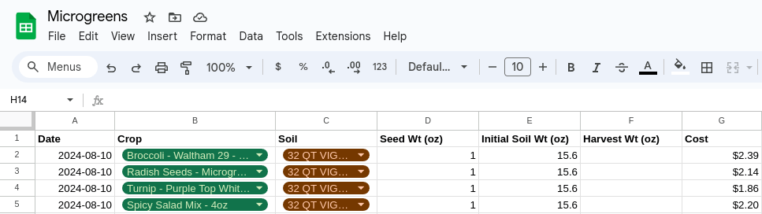

+++
title = "Microgreens"
+++

I've recently started a small home microgreen "farm". It consists of a cheap Amazon Basics wire rack and cheap plastic trays. The soil is run-of-the-mill Home Depot potting mix and the seeds come from [True Leaf Market](https://www.trueleafmarket.com/).

It's the middle of summer here in New Jersey right now so I don't anticipate using a grow light, but I have a spare one from a long while back when I was experimenting with hydroponics. I anticipate needing something a little less bulky in the future but it should suffice for if this carries through winter.

I've been tracking my costs and yields in a Google Sheet. I'm excited for the first harvest!

*The Google Sheet tracks inventory, costs, and yields.*
