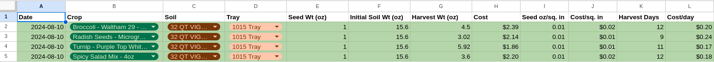
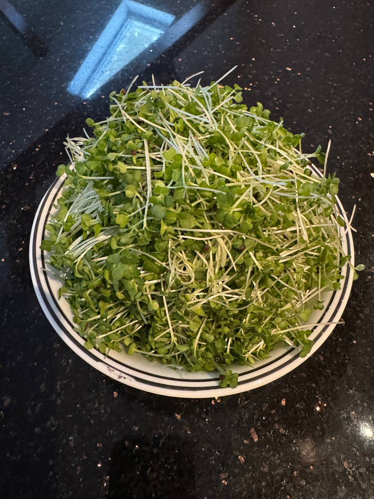
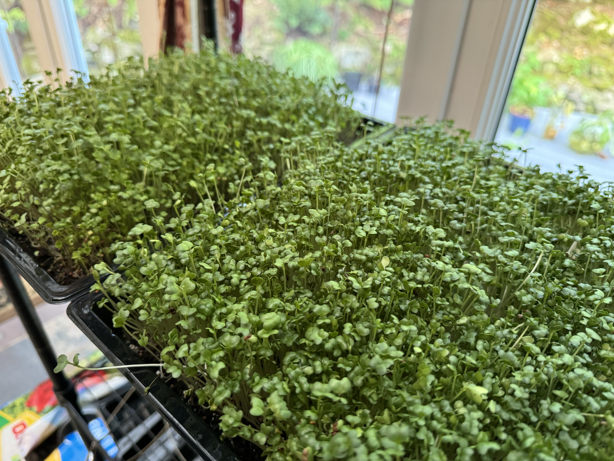
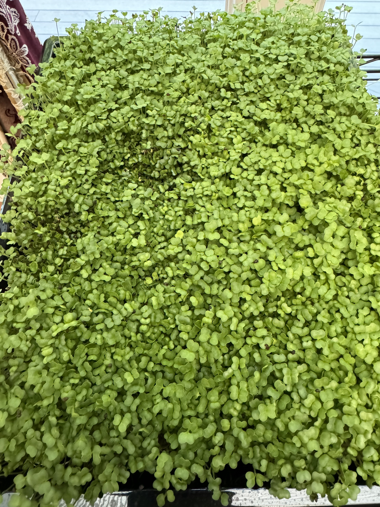
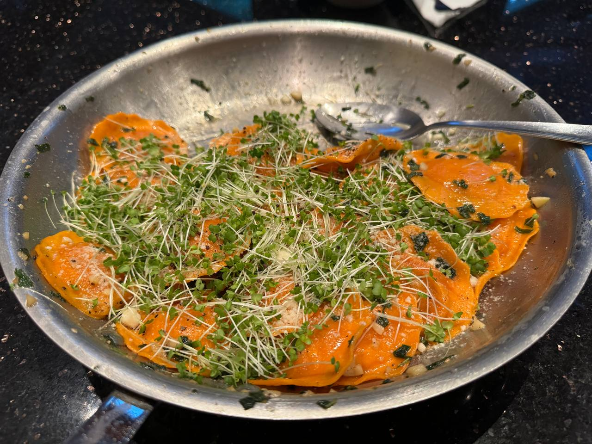

+++
title = "Update 1"
date = "2024-08-24T14:13:15-04:00"
+++

After 12 days, I harvested just over 1lb of food! I used kitchen shears to cut as close to the base as possible and weighed each tray's clippings on a scale that measured to ounces the thousandth.

Overall, this was fun and I plan to do another set of trays this weekend. The feedback cycle is quick and rewarding and the cost-to-entry was extremely low.

See spreadsheet below for details on the first grow. Enjoy some (limited) pictures of the first grow!

|   |   |
| --- | --- |
|  |  |
|  |  |
