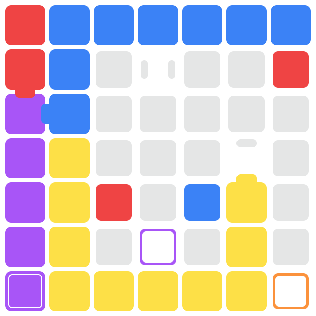
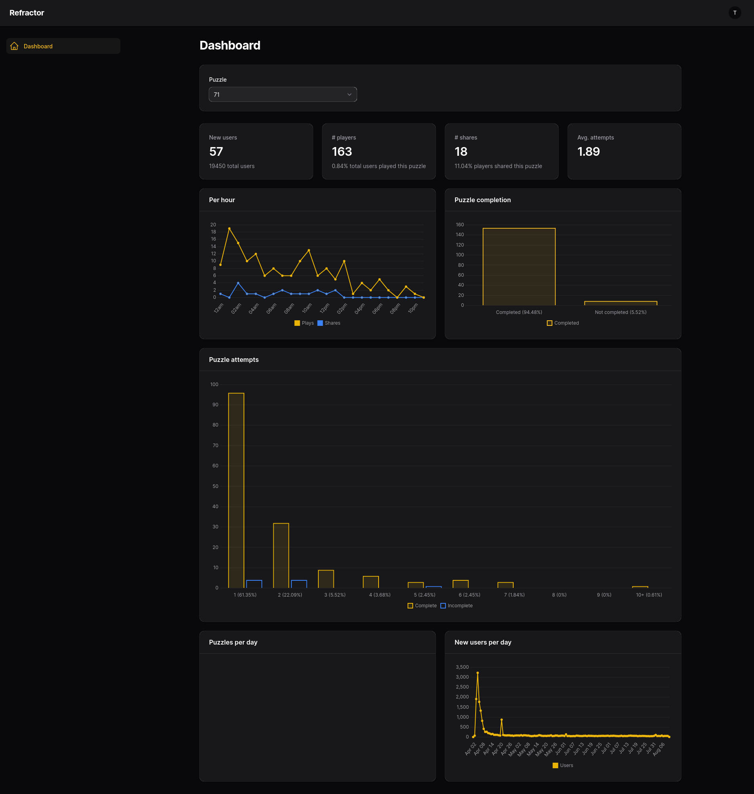

+++
title = "Refractor"
date = "2025-01-14T14:13:15-04:00"
+++

[Play Refractor](https://refractor-game.com)

> **Update January 14, 2025**: Writing puzzles takes a lot of thought and time. Despite efforts to try and write an automatic way to create levels, nothing has worked well. The truth is, creating levels takes time and effort and is becoming a chore for me to do daily. I plan to write more about the process but for now, there will be no more daily puzzles. I do wish to pick up the project in the future. I had ideas and did some preliminary programming to support ideas like "portals". I will post an update if/when any such progress happens.

## Concept

I wanted something fun for my newborn daughter to eventually play. I also wanted to build something semi-educational.

Refractor is a game about combining colors to reach the goals. The goal is to teach primary and secondary colors and
sharpen problem solving skills.

~~New puzzles daily!~~

## Tech

- Laravel
- Filament
- SQLite / LiteFS
- React

### Architecture

The game is built using a single React context with over 50 unit tests. There is only one method exposed by
the context: `interact(x: number, y: number): void`.

All logic for moving around the board is handled within this `interact` method. It checks for tile availability, if the
next tile is a combination (refractor), and/or if a goal is reached.

On each turn, all goals are checked for completion. When all goals are completed, the game state is set to complete and
the puzzle ends.

### Admin

I built a small admin in Filament to view player and puzzle stats. That's really all it does at the moment.

### Editor

As an admin, I have access to an editor which is driven entirely by shortcuts only I know. The editor looks exactly like
the play screen but I've enabled keyboard shortcuts to place colored tiles, refractors, and goals. For example, I can
hover over a tile and press "x" multiple times to cycle through the available refractor styles. Additionally, I can
press "space" to clear the tile.

### Hosting

Refractor is hosted on [Fly.io](https://fly.io). I'm a fan. It's easy, simple, and cheap. Refractor costs a little over
$6/month to host, including the distributed SQLite database.

## Future Plans

I really need to make a maze generator. Right now, I'm creating all puzzles by hand the night (or a couple nights)
before.

It's not too hard, and I enjoy doing it, but I'm also missing out on the fun of a daily puzzle. Creating a maze
generator would allow me to generate an infinite number of puzzles without additional effort.
